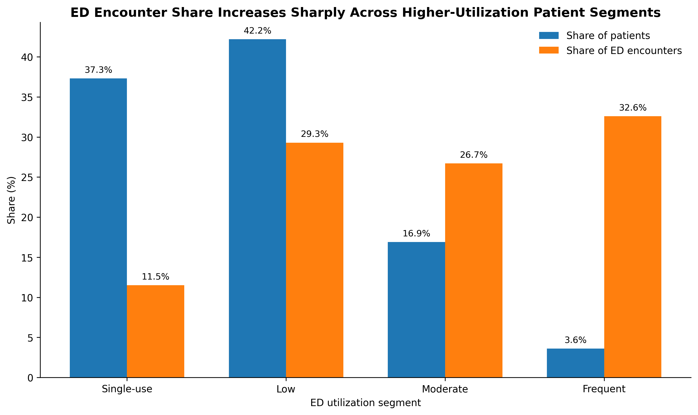
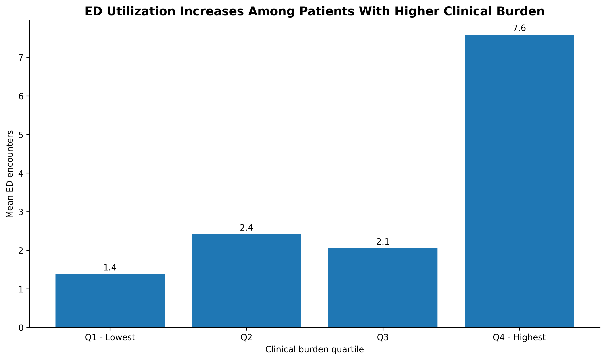
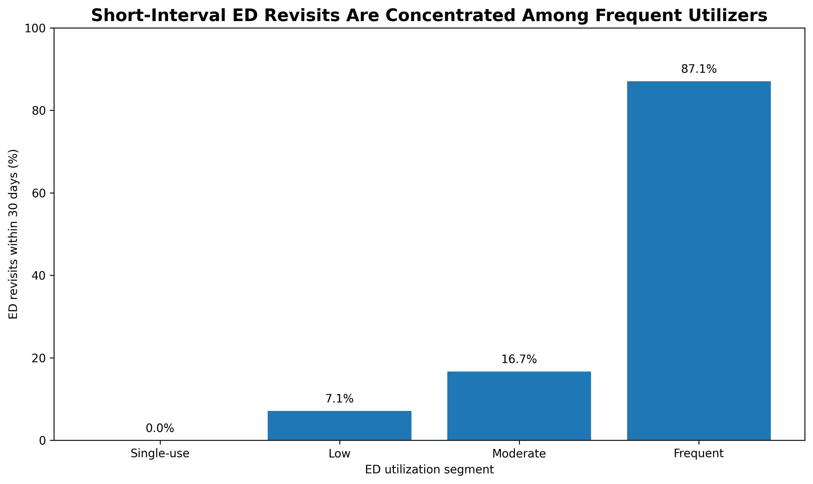

# EHR Patient Journey & Emergency Department Utilization Analytics

## Overview

This project analyzes longitudinal electronic health record (EHR) data to identify patterns associated with emergency department (ED) utilization.

The analysis moves from patient-level healthcare journeys to ED utilization segmentation, clinical burden, and short-interval revisits, with the goal of identifying potentially actionable patterns for population health and care management.

## Key Questions

- How concentrated is ED utilization among patients?
- Are patients with greater clinical burden more likely to use the ED?
- Do frequent ED utilizers demonstrate clustered patterns of repeat utilization?
- Which patient characteristics remain associated with ED utilization after adjustment?

## Dataset

The analysis uses a longitudinal synthetic EHR dataset containing:

- 108 patients
- 5,571 healthcare encounters
- 3,517 condition records
- 270 emergency department encounters
- 83 patients with at least one ED encounter

Because the data are synthetic and the frequent-utilizer subgroup is small, findings should be interpreted as exploratory rather than population-level estimates.

## Key Findings

### 1. ED utilization was highly concentrated

Only **3 patients (3.6% of ED patients)** met the frequent-utilizer definition, yet they accounted for **32.6% of all ED encounters**.



### 2. Higher clinical burden was associated with greater ED utilization

Patients in the highest clinical-burden quartile averaged **7.6 ED encounters**, compared with **1.4 encounters** among patients in the lowest quartile.

In a multivariable negative binomial model adjusting for age, each additional 10 documented unique conditions was associated with approximately **2.39× the expected ED encounter rate**.

The association remained after excluding the highest-utilization patient (**IRR 1.74**), suggesting that the overall relationship was not explained solely by one extreme observation.



### 3. Frequent ED utilization was characterized by short-interval revisits

Among repeat encounters generated by frequent utilizers, **87.1% occurred within 30 days of the previous ED encounter**, compared with **7.1% among low utilizers** and **16.7% among moderate utilizers**.

Frequent utilizers had a median interval of only **7 days between consecutive ED encounters**.



## Potential Healthcare Application

The analysis suggests that ED utilization may be driven by a small subgroup of patients experiencing both greater clinical complexity and tightly clustered episodes of acute care.

From a healthcare analytics perspective, combining measures of:

- recent ED utilization,
- clinical burden, and
- short-interval revisits

could help identify patients who may benefit from targeted care coordination, outpatient follow-up, or population health interventions.

## Methods

Analysis was conducted in Python using:

- pandas
- NumPy
- Matplotlib
- SciPy
- statsmodels

Methods included:

- longitudinal patient-level aggregation
- rolling 365-day ED utilization measurement
- patient utilization segmentation
- clinical burden normalization
- Spearman correlation analysis
- negative binomial regression
- sensitivity analyses excluding the highest-utilization patient
- short-interval revisit analysis

## Project Structure

```text
ehr-patient-journey-analytics/
│
├── notebooks/
│   ├── 01_data_understanding.ipynb
│   ├── 02_patient_journey.ipynb
│   ├── 03_patient_level_analysis.ipynb
│   ├── 04_ed_utilization_drivers.ipynb
│   └── 05_utilization_patterns.ipynb
│
├── reports/
│   └── figures/
│
├── sql/
│
└── README.md
```

## Limitations

This project uses synthetic EHR data and includes only **83 ED patients**, with **3 patients classified as frequent utilizers**. Results should therefore be interpreted as exploratory patterns and demonstrations of an analytical framework rather than estimates intended for clinical decision-making.

## Tools

**Python | pandas | NumPy | Matplotlib | SciPy | statsmodels | Jupyter Notebook**