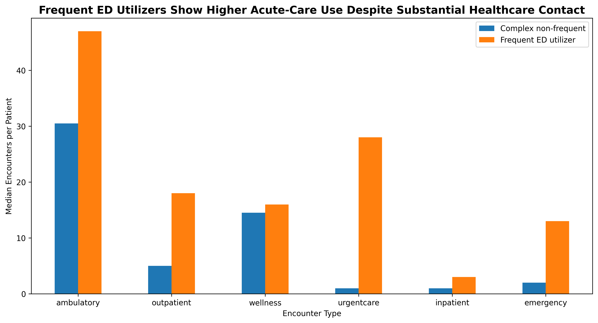

# EHR Patient Journey & Emergency Department Utilization Analytics

## Overview

This project analyzes longitudinal electronic health record (EHR) data to identify patterns associated with emergency department (ED) utilization.

The analysis moves from patient-level healthcare journeys to ED utilization segmentation, clinical burden, and short-interval revisits, with the goal of identifying potentially actionable patterns for population health and care management.

## Key Questions

- How concentrated is ED utilization among patients?
- Are patients with greater clinical burden more likely to use the ED?
- Do frequent ED utilizers demonstrate clustered patterns of repeat utilization?
- Which patient characteristics remain associated with ED utilization after adjustment?

## Dataset

The analysis uses a longitudinal synthetic EHR dataset containing:

- 108 patients
- 5,571 healthcare encounters
- 3,517 condition records
- 270 emergency department encounters
- 83 patients with at least one ED encounter

Because the data are synthetic and the frequent-utilizer subgroup is small, findings should be interpreted as exploratory rather than population-level estimates.

## Key Findings

## Key Findings

### 1. ED utilization was highly concentrated

Only **3 patients (3.6% of ED patients)** met the frequent-utilizer definition, yet they accounted for **32.6% of all ED encounters**.


### 2. Higher clinical burden was associated with greater ED utilization

Patients in the highest clinical-burden quartile averaged **7.6 ED encounters**, compared with **1.4 encounters** among patients in the lowest quartile.

In adjusted modeling, greater documented clinical burden remained associated with higher expected ED utilization, and the association persisted after excluding the highest-utilization patient.


### 3. Frequent ED utilizers showed a distinct clinical profile

Within this synthetic dataset, frequent ED utilizers showed a strong concentration of **cardiometabolic and renal conditions**, including chronic kidney disease, diabetic kidney disease, ischemic heart disease, metabolic syndrome, and type 2 diabetes.

Because the frequent-utilizer subgroup contained only **3 patients**, these findings should be interpreted as exploratory clinical signals rather than population-level conclusions.

### 4. Frequent ED utilization did not reflect limited healthcare contact

Compared with clinically complex patients who were not frequent ED users, frequent utilizers had more encounters across multiple healthcare settings.

Median encounters per patient included:

- **Ambulatory:** 47 vs. 30.5
- **Outpatient:** 18 vs. 5
- **Urgent care:** 28 vs. 1
- **Inpatient:** 3 vs. 1
- **Emergency:** 13 vs. 2

This suggests that repeated ED utilization in this dataset was not simply associated with lack of healthcare contact. Instead, frequent utilizers demonstrated a substantially higher overall intensity of healthcare use, particularly in acute and urgent settings.



### 5. Preventive care represented a smaller share of non-ED utilization among frequent utilizers

Among clinically complex non-frequent patients, wellness encounters represented a median **30.5% of non-ED care**, compared with **14.7%** among frequent ED utilizers.

At the same time, urgent care represented **19.6%** of non-ED care among frequent utilizers compared with **2.2%** among clinically complex non-frequent patients.

This pattern may indicate differences in how patients interact with the healthcare system, although the small frequent-utilizer sample prevents causal interpretation.

## Potential Healthcare Application

The analysis suggests that frequent ED utilization may reflect more than clinical complexity alone.

In this synthetic cohort, frequent ED utilizers had:

- greater documented clinical burden,
- higher utilization across multiple healthcare settings,
- substantially more urgent-care and emergency encounters, and
- a smaller proportional share of wellness care.

These patterns suggest that useful healthcare analytics should move beyond simply identifying high utilizers and instead examine the combination of **clinical complexity, care-setting mix, and longitudinal utilization patterns**.

Such information could support more targeted approaches to care coordination, case management, and population health intervention.

## Methods

Analysis was conducted in Python using:

- pandas
- NumPy
- Matplotlib
- SciPy
- statsmodels

Methods included:

- longitudinal patient-level aggregation
- rolling 365-day ED utilization measurement
- patient utilization segmentation
- clinical burden normalization
- Spearman correlation analysis
- negative binomial regression
- sensitivity analyses excluding the highest-utilization patient
- short-interval revisit analysis

## Project Structure

```text
ehr-patient-journey-analytics/
│
├── notebooks/
│   ├── 01_data_understanding.ipynb
│   ├── 02_patient_journey.ipynb
│   ├── 03_patient_level_analysis.ipynb
│   ├── 04_ed_utilization_drivers.ipynb
│   └── 05_utilization_patterns.ipynb
│
├── reports/
│   └── figures/
│
├── sql/
│
└── README.md
```

## Limitations

This project uses synthetic EHR data and includes only **83 ED patients**, with **3 patients classified as frequent utilizers**. Results should therefore be interpreted as exploratory patterns and demonstrations of an analytical framework rather than estimates intended for clinical decision-making.

## Tools

**Python | pandas | NumPy | Matplotlib | SciPy | statsmodels | Jupyter Notebook**